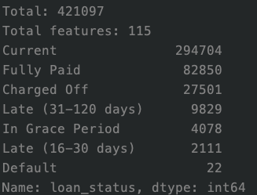

# lendingclub
quantitive credit risk and default analysis course project1

## Description

Todo/Model performance / others… 

4/10 (youngmi)

1. add `data_clean.py` : 处理原数据`LoanStats3d_securev1` dataframe 格式问题，调用 `trans_format()` 及能解决此问题 

2. 按照助教要求，将 loan_status 取 Charged Off, Current, Fully-paid ，并打好标签，去除不能使用的 X 因子，调用 `preprocess()` 即可

   PS. loan_status 处理前各分类数量

   

   

## About Update

每次要上传代码前，要先抓取最新

`git pull`

然后直接 push 到 master/origin 即可（只上传 code ）

`git add example.py`

`git commit -m 'update' `

`git push`

`
